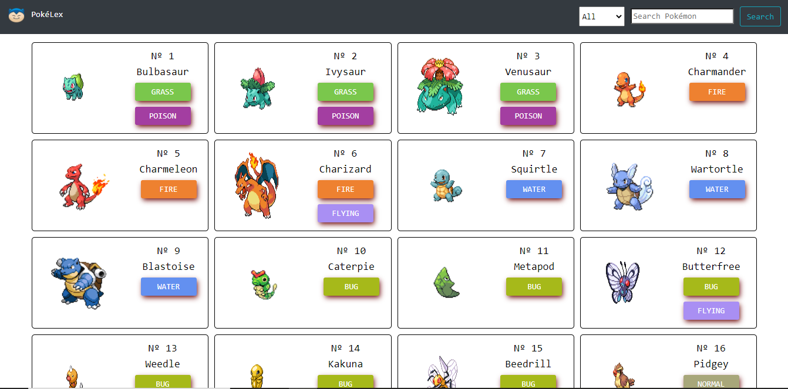
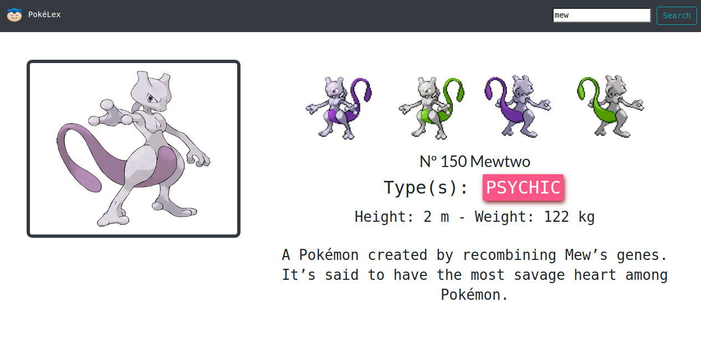

# PokéLex

This React project was created in order to develop a catalogue-like website. It is a Microverse mandatory project in which we need to use our knowledge of React and Redux.
Alongside the options of searching for Pokémon, you are able to filter through Generations and read more details about each Pokémon.

## Live Demo

[Live Demo Link](https://pokelex.netlify.app/)

## Built With

- React / React-Bootstrap
- Javascript
- HTML / CSS

## Getting Started

To get a local copy up and running follow these simple example steps.

- Git clone git@github.com:abouhid/Pokelex.git
- Move to the root directory in your command line
- run `npm install`
- run `npm start`

## Authors

👤 **Alexandre Bouhid**

- Github: [@abouhid](https://github.com/abouhid)
- LinkedIn: [Alexandre Bouhid](https://www.linkedin.com/in/alexandrebouhid/)

## 🤝 Contributing

Contributions, issues and feature requests are welcome!

## Show your support

Give a ⭐️ if you like this project!

## 📝 License

This project is [MIT](lic.url) licensed.
